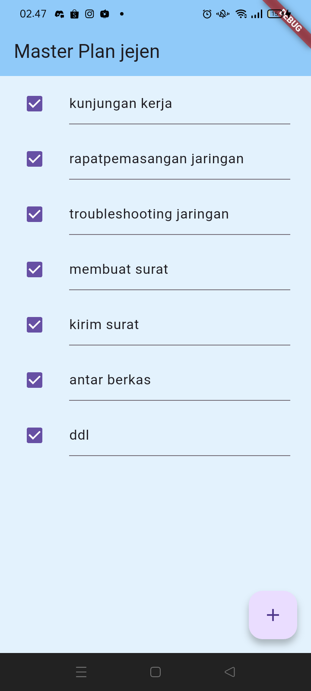

# master_plan

A new Flutter project.

NAMA  : JEJEN JAENUDIN

NIM   : 1125170031

## Getting Started

## **Tugas Praktikum 1: Dasar State dengan Model-View**

dari project yang dibuat saya mencoba untuk memperaktekan bagaimana membuat plan yang sederhana menggunakan beberapa widget yang di antaranya :

**1. PlanScreen Widget:**
- PlanScreen adalah StatefulWidget, yang berarti ia memiliki status yang dapat berubah. Widget ini mengelola   
  sebuah objek Plan yang berisi daftar tugas yang dapat diubah.
- Di dalam kelas PlanScreen, kita mendeklarasikan state _PlanScreenState yang akan menangani logika dan UI 
  dari layar tersebut.

**2. _PlanScreenState Class:**
Kelas ini mengontrol tampilan dan interaksi di layar PlanScreen:

- plan: Objek Plan yang menyimpan informasi rencana yang berisi nama rencana dan daftar tugas. Diinisialisasi 
  dengan const Plan(), yang berarti rencana ini kosong pada awalnya.
- scrollController: Sebuah objek ScrollController yang digunakan untuk mengatur perilaku scroll pada tampilan 
  daftar tugas.

**3. initState Method:**
Method ini dipanggil sekali ketika widget pertama kali dimasukkan ke dalam pohon widget.

- scrollController diinisialisasi di sini, dan listener ditambahkan untuk menangani fokus keyboard. Ketika 
   pengguna menggulir, fokus keyboard akan dipindahkan menggunakan requestFocus(FocusNode()), yang efektif menyembunyikan keyboard jika pengguna menggulir.

**4. build Method:**
Method ini membangun UI dari PlanScreen:

- AppBar: Menampilkan judul "Master Plan JEJEN JAENDUIN".
- body: Menampilkan daftar tugas dengan menggunakan metode _buildList().
- floatingActionButton: Sebuah tombol berbentuk bulat dengan ikon plus (tambah), yang ketika ditekan akan 
   menambahkan tugas baru ke dalam rencana dengan memanggil _buildAddTaskButton().

**5. _buildAddTaskButton Method:**
- Method ini membangun tombol floating action button:

- Ketika tombol ini ditekan, sebuah tugas baru akan ditambahkan ke daftar tasks di objek plan.
   Menggunakan setState() untuk memperbarui status dan merender ulang tampilan. Daftar tugas diperbarui dengan menambah tugas kosong (const Task()).

**6. _buildList Method:**
Method ini membangun daftar tugas menggunakan ListView.builder:

- itemCount: Jumlah item yang akan ditampilkan adalah panjang dari plan.tasks (jumlah tugas).
- itemBuilder: Untuk setiap tugas, kita membangun ListTile yang berisi checkbox dan TextFormField untuk 
   mengedit deskripsi tugas.
- controller: scrollController digunakan untuk mengontrol perilaku scroll.
- keyboardDismissBehavior: Menentukan bagaimana keyboard berperilaku saat pengguna menggulir. Pada platform 
   iOS, keyboard akan hilang jika pengguna menggulir, sedangkan pada platform lain, tidak ada tindakan otomatis saat menggulir.

**7. _buildTaskTile Method:**
Method ini membangun setiap tugas sebagai ListTile:

- Checkbox: Menampilkan status dari task.complete (apakah tugas sudah selesai atau belum). Ketika diubah 
   (misalnya, dicentang atau tidak dicentang), maka status tugas akan diperbarui.
- TextFormField: Menampilkan dan memungkinkan pengeditan deskripsi tugas. Ketika pengguna mengetik sesuatu,   
   setState() dipanggil untuk memperbarui tugas tersebut.
- Ketika ada perubahan pada tugas (baik status checkbox atau deskripsi), setState() digunakan untuk membuat   
   salinan baru dari plan.tasks dan memperbarui item yang sesuai dalam daftar.

**8. dispose Method:**
Method ini dipanggil ketika widget dibuang atau dihancurkan.

- Di sini, scrollController.dispose() dipanggil untuk melepaskan sumber daya yang digunakan oleh scrollController, seperti memori dan listener yang ditambahkan.

## **Ringkasan Proses:**
1. Menambahkan Tugas: Ketika tombol "+" di bagian bawah layar ditekan, tugas baru ditambahkan ke dalam          
   daftar tugas.
2. Mengecek atau Mengedit Tugas: Setiap tugas dalam daftar dapat dicentang/di-uncheck dan deskripsinya          
   dapat diubah.
3. Menyimpan Perubahan: Setiap kali status atau deskripsi tugas diubah, setState() dipanggil untuk merender
   ulang tampilan dan menyimpan perubahan.

**Potensi Peningkatan:**
    State Management: Untuk aplikasi yang lebih besar, menggunakan Provider atau Riverpod dapat lebih efisien 
untuk manajemen state daripada menggunakan setState yang mungkin kurang efisien untuk struktur data besar.
Validasi Input: Bisa ditambahkan validasi untuk memeriksa input kosong atau invalid pada deskripsi tugas.
Optimisasi Performansi: Jika ada banyak tugas, pertimbangkan menggunakan ListView.builder lebih efisien dalam pengelolaan memori, dan menambahkan cache atau menggunakan SliverList untuk meningkatkan performa.

## **Maksud dari langkah 4 pada praktikum tersebut! Mengapa dilakukan demikian?**

Export di Dart adalah sebuah fitur yang memungkinkan Anda untuk mengimpor file Dart lainnya secara lebih 
ringkas dan efisien. Dengan export, Anda bisa menyediakan API atau interface tertentu yang berisi semua file yang diperlukan dalam satu tempat, sehingga kode yang mengimpor hanya perlu mengakses satu file saja, alih-alih mengimpor berbagai file secara terpisah.

- export digunakan untuk mengekspor file atau bagian tertentu dari file agar bisa digunakan oleh file lain.

- Biasanya, export digunakan untuk mempermudah dan merapikan proses impor. Sebagai contoh, jika Anda memiliki beberapa model, Anda bisa membuat satu file yang mengekspor semua model tersebut agar hanya dengan satu kali impor, Anda bisa mengakses semuanya.

**Keuntungan Menggunakan export:**

1. Mempermudah Impor: Daripada mengimpor banyak file satu per satu, Anda hanya perlu mengimpor satu file, 
   seperti data_layer.dart, dan semua model yang diekspor akan tersedia.

2. Pengorganisasian Kode: Jika aplikasi Anda besar dan memiliki banyak model, export membantu Anda  
   mengorganisir dan memisahkan kode dengan lebih baik.

3. Modularisasi: Dengan menggunakan export, Anda memecah aplikasi menjadi modul-modul kecil dan terorganisir. 
   File ekspor bertindak sebagai "pintu gerbang" yang mengontrol apa saja yang bisa diakses di luar modul.

4. Kemudahan Pemeliharaan: Saat Anda ingin menambah atau mengubah sesuatu dalam kumpulan model, Anda cukup 
   mengedit file data_layer.dart, tanpa perlu memperbarui setiap file yang mengimpor model tersebut.

**NOTE**
Export digunakan untuk mengekspor file atau bagian-bagian dari file agar bisa digunakan oleh file lain.
Dengan menggunakan export, Anda bisa merangkum banyak ekspor ke dalam satu file, yang mempermudah proses impor dan menjaga kode tetap bersih dan terorganisir.

## **Mengapa perlu variabel plan di langkah 6 pada praktikum tersebut? Mengapa dibuat konstanta ?**

Variabel, dalam konteks pemrograman dan Flutter, digunakan untuk menyimpan data atau objek yang digunakan 
sepanjang siklus hidup aplikasi. Dalam kode yang Anda berikan, variabel Plan plan digunakan untuk menyimpan instansi objek dari kelas Plan.

**Alasan Mengapa Perlu Variabel:**

1. Menyimpan Data dan Status: Variabel digunakan untuk menyimpan data yang digunakan di dalam aplikasi, seperti 
   Plan plan yang berisi objek dari kelas Plan. Ini memungkinkan Anda untuk mengelola dan memodifikasi data sesuai kebutuhan selama siklus hidup widget tersebut

2. Menjaga Status di StatefulWidget: Di dalam widget dengan StatefulWidget seperti PlanScreen, variabel plan   
   membantu menjaga dan memodifikasi status widget. Karena StatefulWidget memiliki dua bagian: State dan Widget, variabel tersebut memungkinkan State untuk menyimpan informasi atau data yang akan digunakan untuk membangun UI.

3. Menyimpan Nilai yang Dapat Berubah: Jika Anda ingin nilai tersebut berubah berdasarkan interaksi pengguna 
   atau data dinamis lainnya, Anda memerlukan variabel untuk menyimpan perubahan tersebut. Sebagai contoh, jika Plan memiliki data yang berubah berdasarkan input atau aksi pengguna, variabel ini memungkinkan Anda untuk menyimpan dan mengelola perubahan tersebut.

4. Menghindari Rebuild Berulang: Dalam StatefulWidget, variabel seperti Plan plan memungkinkan Anda untuk 
   memodifikasi data atau status aplikasi tanpa memerlukan pembuatan ulang widget dari awal. Variabel tersebut membantu mempertahankan status saat UI diperbarui.

  ## **Apa kegunaan method pada Langkah 11 dan 13 dalam lifecyle state ?**

Tujuan dari kode tersebut ialah untuk menghilangkan fokus dari elemen input (misalnya TextField) saat 
pengguna menggulir tampilan. Ini sangat berguna untuk meningkatkan pengalaman pengguna ketika berinteraksi dengan form atau kolom input dalam aplikasi, karena jika ada elemen input yang sedang fokus dan pengguna menggulir, itu bisa mengganggu pengalaman pengguna.

  contoh :

    Jika Anda memiliki beberapa TextField atau kolom input di dalam tampilan yang bisa digulir, ketika pengguna 
  menggulir ke bawah, keyboard dapat tetap muncul jika fokus masih ada di input yang sebelumnya. Dengan menghilangkan fokus setiap kali pengguna menggulir, Anda memastikan bahwa keyboard disembunyikan dan tidak mengganggu tampilan.

==========================================================================
  ## **Praktikum 2: Mengelola Data Layer dengan InheritedWidget dan InheritedNotifier**

  

Di praktek ke dua ini saya akan mencoba bagaimana meletakkan model dalam pohon widget 

sedangkan model bukanlah widget, sehingga tidak akan tampil pada screen.
Solusi yang saya gunakan ialah dengan cara menggunakan InheritedWidget. 

InheritedWidget itu berbeda, ia dapat meneruskan data ke sub-widget turunannya (biasanya ketika Anda menerapkan decomposition widget). Jika dilihat dari perspektif user, itu tidak akan terlihat prosesnya (invisible). InheritedWidget dapat digunakan sebagai pintu untuk komunikasi antara view dan data layers.

sebuah widget di Flutter yang memungkinkan kita untuk membagikan data secara efisien ke widget-widget turunannya dalam pohon widget, tanpa perlu secara eksplisit melewatkan data melalui konstruktor pada setiap widget. Ini sangat berguna saat kita memiliki data yang perlu diakses oleh banyak widget di berbagai level dalam pohon widget, seperti tema aplikasi, pengaturan, atau status aplikasi global.

Konsep Dasar InheritedWidget:
InheritedWidget bekerja dengan cara memberikan data kepada widget anak melalui mekanisme yang disebut dependency. Widget anak yang membutuhkan data dari InheritedWidget dapat mengaksesnya menggunakan BuildContext.

Setiap kali data yang dibagikan oleh InheritedWidget berubah, widget yang tergantung padanya akan diberi tahu untuk memperbarui dirinya dan merender ulang.

InheritedWidget dapat di pergunakan Ketika kita perlu membagikan data atau model ke banyak widget di aplikasi.
Ketika kita ingin berbagi data yang lebih kompleks (seperti status aplikasi atau konfigurasi) di seluruh aplikasi.
Jika kita ingin membuat data tersebut tersedia di berbagai lapisan widget tanpa perlu melewatkan data secara eksplisit.

Struktur dari widget InheritedWidget adalah kelas dasar yang Anda perlu extend jika ingin membuat widget kustom yang membagikan data.
kita harus override method updateShouldNotify() untuk menentukan kapan widget yang bergantung harus diperbarui ketika data berubah.

pada langkah pertama mengapa kita menggunakan InheritedNotifier?

berikut penjelasan kenapa kita menggunakan widget tersebut

InheritedNotifier adalah subclass dari InheritedWidget yang bekerja dengan objek yang mengimplementasikan 
Listenable, seperti ChangeNotifier. Dengan InheritedNotifier, kita dapat membagikan objek yang bisa memberikan notifikasi tentang perubahan status (misalnya, model yang memperbarui status UI) di seluruh pohon widget.

Keuntungan Menggunakan InheritedNotifier:
1. Penggabungan InheritedWidget dan ChangeNotifier:

-  Dengan InheritedNotifier, kita tidak perlu mengelola pemberitahuan perubahan secara manual seperti yang kita 
   lakukan dengan InheritedWidget biasa.

- Cukup dengan memberi tahu pendengar menggunakan notifyListeners() pada ChangeNotifier, dan InheritedNotifier 
  akan mengatur pemberitahuan ulang secara otomatis.

2. Pembaruan UI yang Efisien:

Ketika data dalam objek yang dibungkus oleh InheritedNotifier berubah, hanya widget yang bergantung pada data tersebut yang akan di-render ulang, bukan seluruh pohon widget. Ini mengurangi beban render dan meningkatkan performa.

3. Kemudahan Implementasi:

Daripada membuat InheritedWidget sendiri dan menulis kode untuk mengelola pemberitahuan perubahan data, InheritedNotifier memungkinkan Anda untuk melakukannya dengan lebih mudah dan lebih jelas.

==========================================================================
## **Praktikum 3: Membuat State di Multiple Screens**
  

kali ini saya memperaktekan praktekum ke 3 yaitu membuat layar screen yang dipergunakan untuk menambahkan dan mengelola rencana mereka dalam bentuk daftar rencana yang dapat dilihat dan dipilih. Secara lebih rinci, tujuan dalam praktek ke tiga ini adalah sebagai berikut :

1. Membuat Rencana Baru (Plan)
   - Tujuan: Mengizinkan pengguna untuk menambahkan rencana baru ke dalam daftar rencana mereka.

   - Di layar ini, pengguna dapat memasukkan nama rencana yang baru menggunakan TextField. Setelah itu,   
      pengguna bisa menekan tombol "enter" atau menyelesaikan editannya, yang akan memicu metode addPlan() untuk menambahkan rencana baru ke dalam daftar.

2. Menggunakan ValueNotifier untuk State Management
   -Tujuan: Mengelola dan memantau perubahan data rencana (daftar rencana) secara real-time dalam aplikasi.

   - ValueNotifier<List<Plan>> digunakan untuk menyimpan daftar rencana (List<Plan>) yang dapat diperbarui 
     secara langsung dan memicu pembaruan pada tampilan (UI). Ketika rencana baru ditambahkan, ValueNotifier akan diberi nilai baru, dan UI akan diperbarui menggunakan setState(), memungkinkan pengguna melihat daftar rencana yang terbaru.

3. Menampilkan Daftar Rencana

   - Tujuan: Menampilkan semua rencana yang telah dibuat oleh pengguna.

   - Menggunakan ListView.builder, daftar rencana yang ada akan ditampilkan secara dinamis. Setiap item dalam  
      daftar (ListTile) menunjukkan nama rencana dan status dari rencana tersebut (melalui completenessMessage).
      Jika tidak ada rencana yang ada (daftar kosong), layar akan menampilkan pesan yang mengindikasikan bahwa belum ada rencana yang dibuat.

4. Navigasi ke Layar Detail Rencana
   -Tujuan: Mengizinkan pengguna untuk melihat detail dari rencana yang telah dipilih.
   -Ketika pengguna mengetuk salah satu item di daftar rencana, aplikasi akan menavigasi ke layar lain, yaitu 
    PlanScreen, untuk menampilkan detail rencana yang dipilih. Di layar ini, pengguna bisa melihat informasi lebih lanjut tentang rencana yang telah dibuat.

5. UI yang Interaktif dan Responsif
Tujuan: Memberikan pengalaman pengguna yang interaktif dan responsif.
Menggunakan widget seperti TextField, ListView, dan ListTile untuk memungkinkan pengguna membuat rencana baru, melihat daftar rencana yang ada, serta berinteraksi dengan elemen-elemen UI yang ada.

===========================================================================

## **jelaskan maksud dari gambar diagram berikut ini!**

  

  Penjelasan Diagram

Diagram ini menggambarkan struktur (hierarki) dari dua tampilan (screens) dalam pengembangan aplikasi menggunakan Flutter, yaitu **PlanCreatorScreen** dan PlanScreen. Berikut adalah rincian masing-masing bagian:

# Bagian Kiri: PlanCreatorScreen

- MaterialApp: Komponen utama yang membutuhkan material design

- PlanProvider: Pengatur pengadaan data untuk rencana

- PlanCreatorScreen: Layar untuk membuat rencana baru

- Column: Widget yang mengatur komponen secara vertikal
    - TextField: Input teks untuk rencana

    - Expanded: Widget yang memperluas ruang untuk anak widget

         - ListView: Menampilkan daftar item yang dapat discroll

## **Bagian Kanan: PlanScreen**

- MaterialApp: Sama dengan sebelah kiri

- PlanScreen: Layar yang menunjukkan rencana yang sudah dibuat

- Scaffold: Struktur dasar untuk layout halaman

- Column: Digunakan untuk menempatkan widget secara vertikal

    - Expanded: Memungkinkan widget di dalamnya untuk mengisi ruang yang tersedia.

    - SafeArea: Widget untuk menghindari area yang terhalang (seperti notch di ponsel).

    - ListView: Menampilkan daftar item yang dapat discroll

    - Text: Menampilkan teks.

## Arah Navigasi

**Navigator Push:** Proses beralih dari PlanCreatorScreen ke PlanScreen menunjukkan bahwa setelah pengguna selesai membuat rencana, mereka akan dipindahkan ke layar yang menunjukkan rencana tersebut.
Kesimpulan
Diagram ini menggambarkan transisi dan struktur layar dalam aplikasi Flutter, memberikan pemahaman tentang bagaimana antarmuka pengguna dibangun serta bagaimana navigasi terjadi antara dua tampilan yang berbeda.#